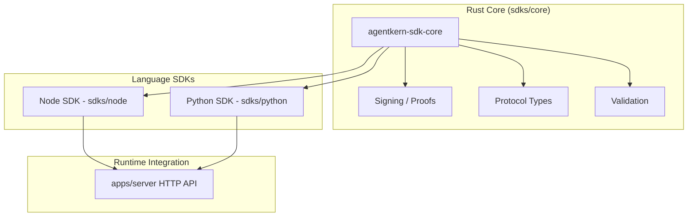

# SDK Architecture: Rust Core + HTTP Runtime (2026)

AgentKern SDKs follow a single model: shared Rust cryptographic core plus HTTP integration with the unified server.

## 🏗️ Architecture

## 🛠️ Implementation Details

### 1. Node SDK (`sdks/node`)
- **Primary Package**: `@agentkern/sdk`
- **Local Capabilities**: Agent identity, proof generation, proof verification
- **Runtime Path**: HTTP API calls to `apps/server` for pillar decisions

### 2. Python SDK (`sdks/python`)
- **Primary Package**: `agentkern`
- **Local Capabilities**: Agent identity and proof operations
- **Runtime Path**: HTTP API calls to `apps/server`

### 3. Shared Core (`sdks/core`)
- **Single Source of Truth** for proof and signing logic
- Reused by both Node and Python SDK packages

---

## 🔒 Security Principles

1. **Local Signing**: Private keys remain in process memory in SDK runtimes.
2. **Deterministic Verification**: Core verification logic is shared across SDKs.
3. **Server-Enforced Runtime Policy**: Gate/Arbiter/Synapse decisions are enforced via server APIs.

## 📅 Roadmap (2026)

- **Q1**: Stabilize Node and Python SDK release workflow
- **Q2**: Expand API-generated client coverage for additional languages
- **Q3**: Strengthen integration test matrices for SDK + server contracts
