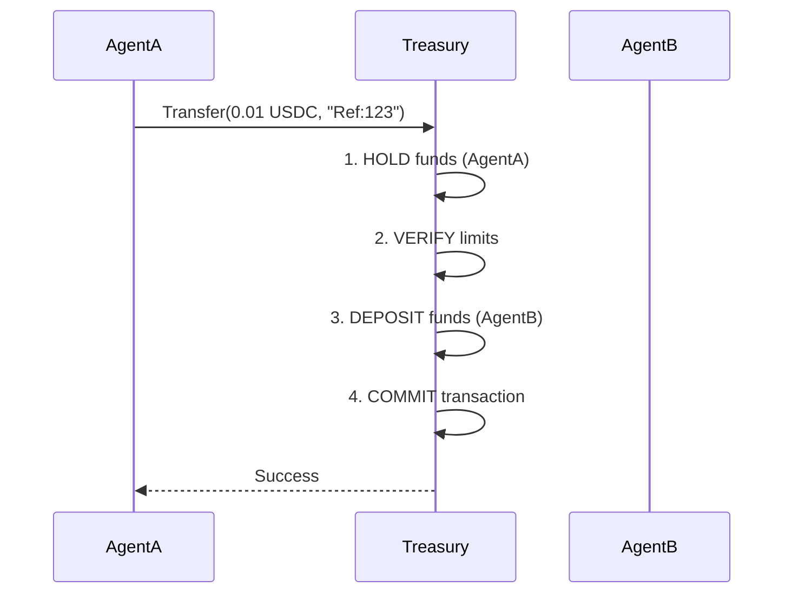

# Treasury Pillar Design

> **Agent Economics & GreenOps** — The financial operating system for autonomous agents.

---

## Table of Contents

1. [Overview](#1-overview)
2. [Core Concept: Atomic Economy](#2-core-concept-atomic-economy)
3. [Balance Ledger](#3-balance-ledger)
4. [Transfer Engine (2PC)](#4-transfer-engine-2pc)
5. [Micropayment Aggregation](#5-micropayment-aggregation)
6. [Budget & Spending Limits](#6-budget--spending-limits)
7. [Distributed Locking](#7-distributed-locking)
8. [GreenOps: Carbon Ledger](#8-greenops-carbon-ledger)
9. [Solar Curve Scheduling](#9-solar-curve-scheduling)
10. [WattTime Integration](#10-watttime-integration)
11. [HTTP API (Server)](#11-http-api-server)
12. [Complete Module Map](#12-complete-module-map)

---

## 1. Overview

**Treasury** provides the financial rails for the AgentKern ecosystem, enabling agents to pay for services, resources, and compute. It integrates **Agent Economics** with **GreenOps** to ensure sustainable autonomous operations.

### Key Capabilities

- **Multi-Currency Support**: USD, USDC, BTC, ETH, and internal VMC credits.
- **Atomic Transfers**: 2-Phase Commit (2PC) for failure-atomic transactions.
- **Micropayments**: Batched settlement for sub-cent efficiency.
- **GreenOps**: Carbon-aware scheduling and footprint tracking.
- **Financial Safety**: Strict budget enforcement and spending limits.

---

## 2. Core Concept: Atomic Economy

Treasury ensures that no funds are lost during agent-to-agent transactions, even if the system crashes.



---

## 3. Balance Ledger

Manages agent accounts in [`balance.rs`](../../packages/pillars/treasury/src/balance.rs).

### Supported Currencies

```rust
pub enum Currency {
    USD,   // Fiat (2 decimals)
    VMC,   // VeriMantle Credits (6 decimals)
    BTC,   // Bitcoin (8 decimals)
    ETH,   // Ethereum (18 decimals)
    USDC,  // Stablecoin (6 decimals)
}
```

### Account Structure

```rust
pub struct AgentBalance {
    pub currency: Currency,
    pub balance: Amount,
    pub pending: Amount, // Locked in 2PC
}

impl AgentBalance {
    pub fn available(&self) -> Amount {
        self.balance - self.pending
    }
}
```

---

## 4. Transfer Engine (2PC)

Implements Two-Phase Commit for transfers in [`transfer.rs`](../../packages/pillars/treasury/src/transfer.rs).

### Transfer Request

```rust
let request = TransferRequest::new(
    "agent-sender",
    "agent-receiver",
    Amount::from_float(10.50, 2),
)
.with_reference("invoice-123")
.with_idempotency_key("req-uuid-v4");
```

### Idempotency

Prevents double-spending by tracking transaction IDs. Retrying a request with the same `idempotency_key` returns the original result without re-processing.

```rust
pub struct TransferEngine {
    // In-memory or Redis-backed state
    pending_transfers: HashMap<TransactionId, PendingTransfer>,
}
```

---

## 5. Micropayment Aggregation

Optimizes high-volume, low-value transactions in [`micropayments.rs`](../../packages/pillars/treasury/src/micropayments.rs).

Instead of settling every $0.0001 transaction on-chain or via DB write, aggregating them into batches.

```rust
// Add payment to buffer
let batch = aggregator.add_payment(PendingPayment {
    from: "agent-a",
    to: "agent-b",
    amount: 0.0001,
});

// Returns Some(batch) only when threshold reached
if let Some(batch) = batch {
    ledger.settle_batch(batch);
}
```

### Configuration

| Parameter | Default | Description |
|-----------|---------|-------------|
| `batch_size` | 100 | Max payments per batch |
| `max_delay` | 60s | Max time before force-flush |
| `min_amount` | $1.00 | Settlement threshold |

---

## 6. Budget & Spending Limits

Safety controls in [`budget.rs`](../../packages/pillars/treasury/src/budget.rs).

### Budget Periods

- `Transaction`: Max per single call
- `Hourly`, `Daily`, `Weekly`, `Monthly`: Time-window limits

### Usage

```rust
let manager = BudgetManager::new();

// Set daily limit: $100.00
manager.set_limit(
    "agent-dev",
    SpendingLimit::new(
        Amount::from_float(100.0, 2),
        BudgetPeriod::Daily
    )
);

// Check before spend
manager.can_spend("agent-dev", &amount)?;
```

---

## 7. Distributed Locking

Multi-node coordination in [`lock.rs`](../../packages/pillars/treasury/src/lock.rs).

Prevents race conditions when multiple Treasury instances access the same wallet/ledger.

```rust
pub enum LockMode {
    Local,  // Single-node (Memory)
    Redis,  // Multi-node (Redis DLM)
    Auto,   // Auto-detect based on env
}

// RAII Guard pattern
{
    let guard = lock_manager.acquire("wallet-123").await?;
    // Critical section...
} // Lock released automatically
```

---

## 8. GreenOps: Carbon Ledger

Tracks environmental impact in [`carbon.rs`](../../packages/pillars/treasury/src/carbon.rs).

### Hardware Awareness

Treasury knows the TDP (Thermal Design Power) of AI accelerators to calculate energy usage accurately.

| Compute Type | Typical Power | Water Usage (L/kWh) |
|--------------|---------------|---------------------|
| `H100` | 700W | 0.30 |
| `A100` | 400W | 0.35 |
| `T4` | 70W | 0.30 |
| `Cpu` | 150W | 0.40 |

### Footprint Calculation

$$ \text{Carbon} = \text{Power (kW)} \times \text{Time (h)} \times \text{Intensity (gCO}_2\text{/kWh)} $$

```rust
let footprint = CarbonFootprint::calculate(
    "agent-1",
    "inference",
    ComputeType::H100,
    5000, // 5s duration
    CarbonRegion::UsEast, // ~350 gCO2/kWh
);
```

---

## 9. Solar Curve Scheduling

Optimizes job scheduling based on renewable energy availability.

```rust
// Check if we are in "peak solar" window (e.g., 10 AM - 2 PM)
if solar_curve.is_peak_now() {
    // Run Low-Priority Batch Jobs
} else {
    // Delay non-urgent work
    let delay = solar_curve.hours_until_peak();
}
```

### Intensity Multiplier

Jobs run during peak renewable hours get a "Green Discount" on their calculated carbon footprint.

---

## 10. WattTime Integration

Real-time grid emissions data via [`watttime.rs`](../../packages/pillars/treasury/src/watttime.rs).

```rust
let client = WattTimeClient::from_env()?;

// Get real-time marginal emissions for location
let intensity = client.get_intensity(37.77, -122.41).await?;
// Returns gCO2/kWh (e.g., 250 for CAISO)
```

---

## 11. HTTP API (Server)

Simple server in [`bin/server.rs`](../../packages/pillars/treasury/src/bin/server.rs).

| Method | Path | Description |
|--------|------|-------------|
| `GET` | `/health` | Health Check |
| `POST` | `/transfer` | (Planned) Execute transfer |
| `GET` | `/balance/:id` | (Planned) Get balance |

Currently serves primarily as a health-check endpoint for orchestrators.

---

## 12. Complete Module Map

| Module | Lines | Purpose |
|--------|-------|---------|
| [`lib.rs`](../../packages/pillars/treasury/src/lib.rs) | 76 | Module exports |
| [`types.rs`](../../packages/pillars/treasury/src/types.rs) | 125 | Core types (Amount, AgentId) |
| [`balance.rs`](../../packages/pillars/treasury/src/balance.rs) | 297 | Ledger & Currency logic |
| [`transfer.rs`](../../packages/pillars/treasury/src/transfer.rs) | 317 | Atomic Transfer Engine |
| [`budget.rs`](../../packages/pillars/treasury/src/budget.rs) | 263 | Spending limits |
| [`micropayments.rs`](../../packages/pillars/treasury/src/micropayments.rs) | 272 | Aggregation logic |
| [`lock.rs`](../../packages/pillars/treasury/src/lock.rs) | 279 | Distributed locking |
| [`carbon.rs`](../../packages/pillars/treasury/src/carbon.rs) | 926 | GreenOps & Hardware data |
| [`watttime.rs`](../../packages/pillars/treasury/src/watttime.rs) | 248 | WattTime API Client |
| [`bin/server.rs`](../../packages/pillars/treasury/src/bin/server.rs) | 20 | HTTP Server |

**Total: ~2,800 lines of Rust**

---

*Last updated: 2025-12-31*
